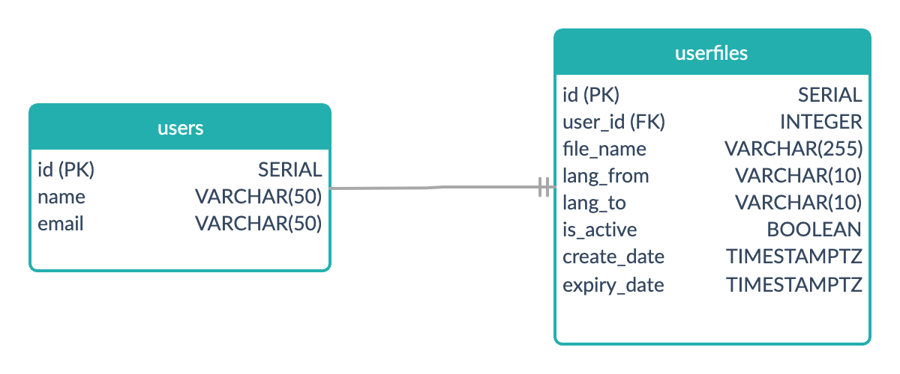

# MTL (Machine Translation)

This is a webapp that let the user to upload a file and download the translated file.

# Installation

1.  Fork and clone the repo

2.  Install the dependencies

    Server: `npm install`
    
    Client: `npm run client-install`

3.  Run the application

    Server: `npm run server`

    Client: `npm run client`

# User flow

# Data Model

