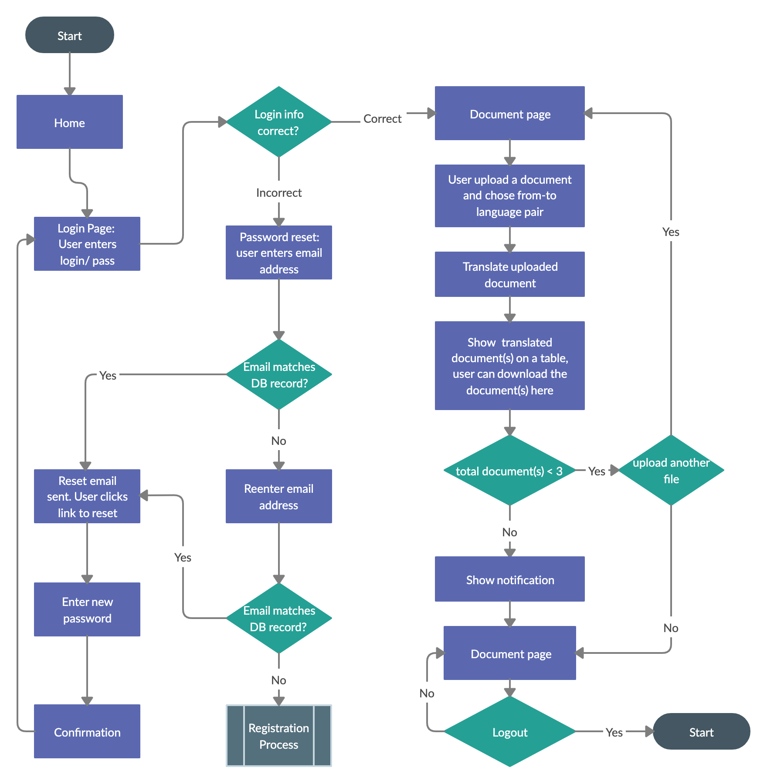

# MTL (Machine Translation)

This is a webapp that let the user to upload a file and download the translated file.

# Installation

1.  Fork and clone the repo

2.  Install the dependencies

    Server: `npm install`
    
    Client: `npm run client-install`

3.  Run the application

    Server: `npm run server`

    Client: `npm run client`

# User flow

# Data Model

# Built with

__API__

[Microsoft Translator](https://www.microsoft.com/en-us/translator/)

__Library__

[express](https://expressjs.com/)

[express-cors](https://github.com/expressjs/cors)

[express-fileupload](https://github.com/richardgirges/express-fileupload)

[dotenv](https://github.com/motdotla/dotenv)

[jszip](https://stuk.github.io/jszip/)

[mongoDB](https://www.mongodb.com/)

[mongoose](https://mongoosejs.com/)

[react](https://reactjs.org/)

[material-ui](https://material-ui.com/)

[material-ui-dropzone](https://github.com/Yuvaleros/material-ui-dropzone)

[axios](https://github.com/axios/axios)

__Authentication__

[Auth0](https://auth0.com/)

[Auth0 express-jwt](https://github.com/auth0/express-jwt)

[Auth0 jwks-rsa](https://github.com/auth0/node-jwks-rsa)

[Auth0 auth0-spa-js](https://github.com/auth0/auth0-spa-js)

