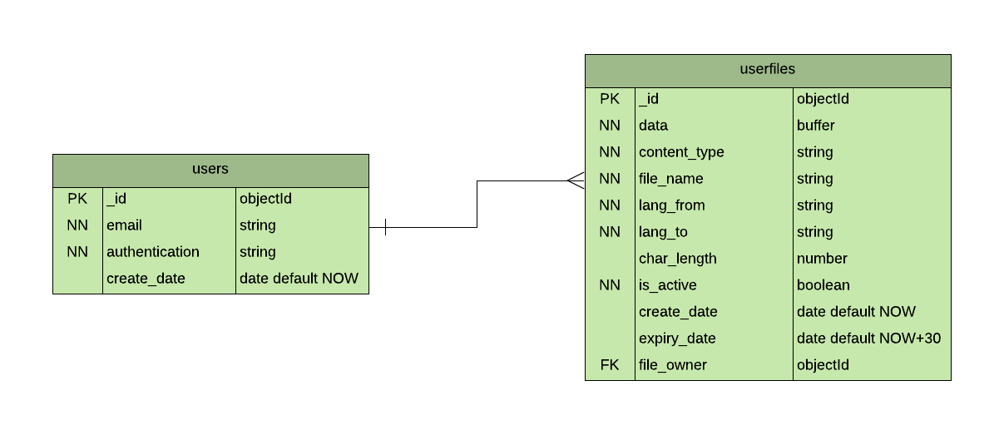

# Txtrans (Machine translation for txt file)

__Description__

This is a webapp that lets users upload text files, choose source and target languages and download a translated version of the files.

__Site__

https://txtrans.herokuapp.com/

# Installation

1.  Fork and clone the repo

2.  Create a file `.env` file in the root folder

    ```
    AUTH0_DOMAIN=<your_auth0_domain>.auth0.com
    AUTH0_AUDIENCE=<your_homepage_url>

    MONGO_URI=mongodb://<host>:<port>/<database_name>

    MS_TRANSLATION_TEXT_SUBSCRIPTION_KEY=<your_microsoft_translation_api_key>
    MS_TRANSLATION_TEXT_ACCESS_TOKEN_URL=<your_microsoft_access_token_url>
    MS_TRANSLATION_TEXT_BASE_URL=<microsoft_translation_api_endpoint>
    ```

3. Create a file `.env.local` in client/

    ```
    REACT_APP_AUTH0_DOMAIN=<your_auth0_domain>.auth0.com
    REACT_APP_AUTH0_AUDIENCE=<your_homepage_url>
    REACT_APP_AUTH0_CLIENTID=<your_auth0_client_id>
    REACT_APP_AUTH0_REDIRECT_URI=<redirect_uri_after_login>
    REACT_APP_AUTH0_RETURN_TO=<redirect_uri_after_logout>

    REACT_APP_MTL_BASE_API=<your_backend_server>
    ```

4.  Install the dependencies

    Server: `npm install`
    
    Client: `npm run client-install`

5.  Run the application

    Server: `npm run server`

    Client: `npm run client`

# User flow


# Data Model



__System table__

table name = translations

| columns               | type     | constraints    | 
| --------------------- | -------- | -------------- | 
| _id                   | objectId | PK             | 
| name                  |   string | NN, U          | 
| time_interval         |   number | default 590000 | 
| time_last_requested   |   number | default 0      | 
| token                 |   string | default ''     | 

# Built with

__APIs__

[Microsoft Translator](https://www.microsoft.com/en-us/translator/)

__Libraries__

[express](https://expressjs.com/)

[express-cors](https://github.com/expressjs/cors)

[express-fileupload](https://github.com/richardgirges/express-fileupload)

[dotenv](https://github.com/motdotla/dotenv)

[jszip](https://stuk.github.io/jszip/)

[qs](https://github.com/ljharb/qs)

[mongoDB](https://www.mongodb.com/)

[mongoose](https://mongoosejs.com/)

[react](https://reactjs.org/)

[material-ui](https://material-ui.com/)

[material-ui-dropzone](https://github.com/Yuvaleros/material-ui-dropzone)

[axios](https://github.com/axios/axios)

__Authentication__

[Auth0](https://auth0.com/)

[Auth0 express-jwt](https://github.com/auth0/express-jwt)

[Auth0 jwks-rsa](https://github.com/auth0/node-jwks-rsa)

[Auth0 auth0-spa-js](https://github.com/auth0/auth0-spa-js)

# Endpoints

__Frontend__

1. `/` Landing Page
   
2. `/documents` Documents Page

__Backend__

1.  ```
    POST /api/translate/documents/
    body: email, authentication
    ```

    If a user is login for the first time then persist the user to the database.
   
    If it’s an existing user, retrieve their saved documents (if any).

2. ```
   POST /api/translate/documents/translate
   body: email, authentication, sourceLanguage, targetLanguage, file
   ```
     
   Get the texts from the user uploaded document and reshape those texts into an http request data and send them to a 3rd party translation API
   
   Save the result of the translation into the database

3. ```
   POST /api/translate/documents/download
   body: email, authentication, nickname, translatedFileIds[]
   ```
   
   Retrieve the translated texts from the database and format those texts into a text file then send the file as an attachment

   If the download request is for multiple files, those files will be zipped before being sent

4. ```
   POST /api/translate/documents/delete
   body: email, authentication, translatedFileIds[]
   ```
   
   Delete the saved document(s)
